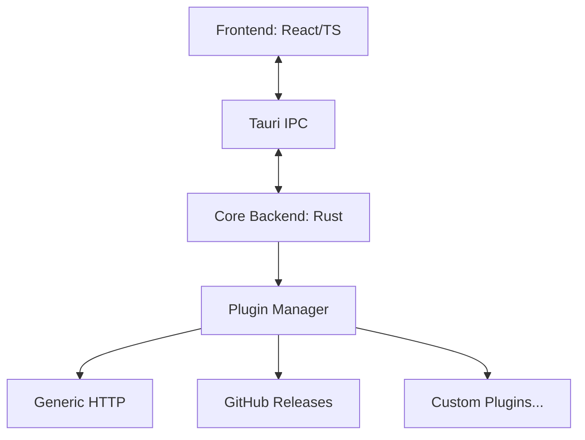

# Architecture

OpenFetch is structured as a monorepo containing a Tauri backend and a React frontend, alongside a suite of plugins and packages.

## System Overview

## Download Engine
Handles queueing, chunking, and resuming of files. It spawns tasks using Tokio to achieve high concurrency.

## Plugin System
Dynamically loads `.dll`/`.so`/`.dylib` files. The Core calls out to plugins using Foreign Function Interfaces (FFI) for URL matching and custom download routines.

## Frontend
Built with React, Tailwind CSS, and Shadcn UI. Communicates with Core via Tauri's IPC commands.

## IPC Flow
1. Frontend sends command (e.g. `analyze_url`).
2. Tauri routes it to Rust backend.
3. Core matches URL to appropriate plugin.
4. Plugin analyzes URL and returns data.
5. Core serializes and sends back to frontend.
